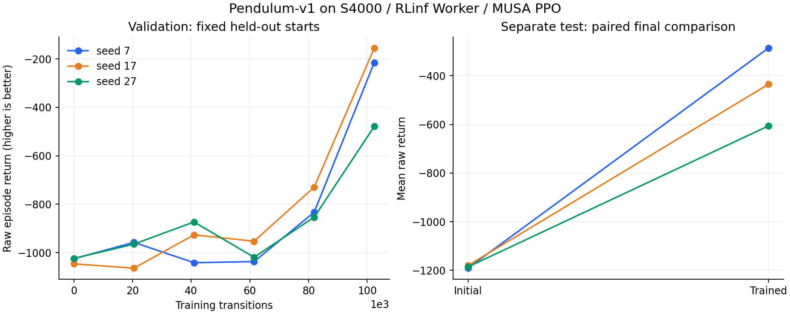
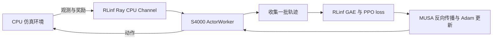
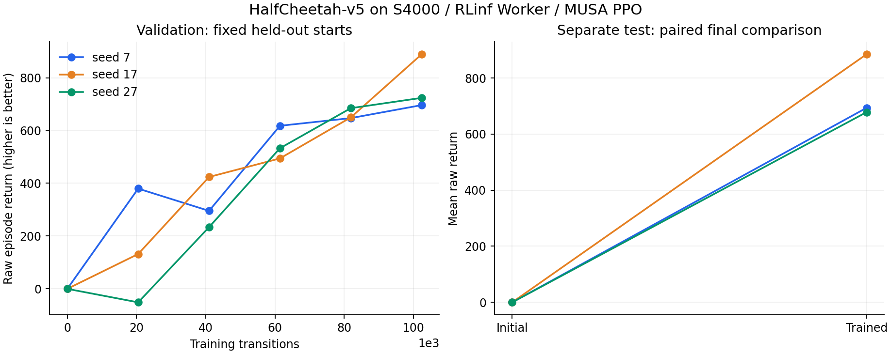

# 路线二：从接口闭环到学习收益

记录日期：2026-10-05。Mac 保存源码与记录，单张租赁 MTT S4000 执行实验。Driver 2.7.0、MUSA 3.1.0、Torch 2.2.0、Torch-MUSA 1.3.0 保持原状；实验使用隔离环境和固定 RLinf 源码。

## Pendulum 三种子学习基线

三个预先声明的训练种子全部完成。每种子训练 102,400 transitions，终点固定；用独立于训练与 validation 的 20 个 test 初始状态评估，回报越高越好。

| 训练种子 | 初始 test 平均回报 | 训练后 test 平均回报 | 配对提升 |
|---|---:|---:|---:|
| 7 | -1191.12 | -286.31 | +904.81 |
| 17 | -1180.24 | -435.37 | +744.87 |
| 27 | -1186.04 | -606.41 | +579.63 |

3/3 种子提升，提升中位数 744.87；训练后回报跨种子均值 -442.70、样本标准差 160.18。通过本项目预先声明的初步工程目标（至少 2/3 提升且提升中位数 ≥300）。三个种子不足以建立统计显著性；此结果不代表已解决 Pendulum，也不代表完整 GR00T/LIBERO 可训练。

左图是固定 validation 初始状态的表现；右图使用另一组 test 初始状态。最终 checkpoint 按固定训练预算选择，没有根据 test 挑选。原始每局回报、训练指标、恢复检查见 [learning evidence](../routes/route2/evidence/learning/)，[汇总 JSON](../routes/route2/evidence/learning/pendulum-summary.json) 保留全部三个种子。

## 这套训练做了什么

策略是把观测转换成动作的网络；rollout 是让策略与环境交互收集轨迹。value 网络估计后续回报，GAE 根据奖励和这些估计计算“这个动作比预期好多少”。PPO 用该信号更新策略，同时限制一次更新的幅度。独立评估关闭探索噪声，在固定初始状态上比较训练前后完整策略。

模型为小型 Gaussian MLP，自定义普通 `nn.Module` ActorWorker 使用真实 RLinf Cluster、Worker、Channel、GAE 与 PPO actor/critic loss；rollout/update 共驻。未接官方 EmbodiedRunner/Actor，不含图像、语言或机器人操作任务。

配方：8 env × 128 horizon × 100 iterations，10 epochs、minibatch 256；每种子 4000 次训练轨迹 optimizer step。Adam lr 3e-4/eps 1e-5，gamma .99、GAE lambda .95、reward scale .1、entropy coefficient 0，critic clipping 禁用、Huber delta 10。Pendulum 不做观测归一化。恢复校验额外重放首批更新，不计入 4000 次轨迹更新。完整命令见 [学习协议](../routes/route2/learning/README.md)。

## MuJoCo 与训练后端

HalfCheetah-v5 正式三种子均完成相同 102,400 transitions，normalization 开启、batch evaluation 开启；终点固定，独立 test seeds 20000–20019。三个种子的参数/Adam、pending observations、normalizer、固定输出、Python/NumPy/Torch CPU/MUSA RNG 同批恢复对照全部通过。

| 训练种子 | 初始 test 平均回报 | 训练后 test 平均回报 | 配对提升 |
|---|---:|---:|---:|
| 7 | -0.33 | 693.69 | +694.02 |
| 17 | -0.32 | 884.94 | +885.26 |
| 27 | -0.33 | 678.26 | +678.58 |

3/3 提升，中位提升 694.02；训练后跨种子均值 752.30、样本标准差 115.13。没有沿用 Pendulum 的专属验收阈值，也不声称达到成熟 HalfCheetah 策略水平。这里的价值是证明 MuJoCo 训练闭环在当前栈上出现跨种子的收益。全部原始 episode 与训练指标见 [HalfCheetah 汇总](../routes/route2/evidence/learning/halfcheetah-summary.json)。

诊断对照保留初始网络权重，只换成训练后的 normalizer，三个种子平均回报仍约 -0.35/-0.35/-0.33。因此本轮观察到的提升不能仅由 normalizer 改变解释。

- HalfCheetah-v5 CPU/MUSA 归一化短测通过；同批恢复后参数、Adam、normalizer、固定输出和 RNG 一致，不恢复 simulator state。
- 实际 HalfCheetah CPU 串行/批量评估的 3 个种子回报和长度精确相同，策略调用 3000→1000。MUSA 批量小闭环完成 256 transitions、8 次轨迹更新并通过恢复。短测没有建立学习收益。
- 首次 HalfCheetah 长测因串行评估效率停止，保留中断证据；正式三种子实验采用批量评估，从初始权重重新训练。中断曲线不算完成结果。
- 单独实验补丁使真实 RLinf `FSDPStrategy` 在旧栈完成 FP32 `NO_SHARD` 包装、forward/backward、`clip_grad_norm_` 调用和 AdamW 更新；local_shard 与 Torch 2.2 DCP 的 MUSA/MCCL checkpoint 保存、恢复和继续更新也通过。CPU 参数最大误差 1.49e-8，恢复后继续更新的模型/optimizer/scheduler 最大误差为0；9 个 CPU 导入/DeviceMesh 回归通过。checkpoint 仍限于单卡、world size 1、同进程新对象。官方 Actor、多卡、offload 或混合精度未验证，见 [后端证据](../routes/route2/evidence/fsdp1/strategy-third.jsonl) 与 [checkpoint 证据](../routes/route2/fsdp_probes/checkpoint-README.md)。

FSDP1 负责模型包装及分布式训练状态管理。下一关是保存/恢复状态，再把训练端和采样端拆开并验证权重同步。原生 Torch FSDP1 和真正 RLinf FSDPStrategy 的证据分别保留。

## GR00T 算子

N1.5 的图像/语言骨干与 action head 包含不同布局和 mask 合约的 attention。官方 MUSA 路径绑定 vendor FlashAttention，旧栈缺少该包；先按固定模型来源抽取合约做数值及梯度测试。

显式 FP32 eager attention 基础探针 32/32 rows 通过，FP32/BF16 外围算子通过。旧 MUSA SDPA 对广播 padding mask 报错；展开 mask 能运行，BF16 对照通过，FP32 梯度仍超过原严格门槛，误差约 1e-5 量级。随后真实 Diffusers 0.30.2 Attention 与固定双层 GR00T DiT 在 S4000 上完成 36 rows；MUSA 12 rows 的 forward、输入 VJP、非零参数 VJP 与 mask 合约通过，严格总 gate 仅保留解析零 `to_k.bias`/`norm_k.bias` 的 relative-L2 失败，独立 semantic gate 为 true。该结果仍不等于加载 GR00T 权重或完成训练。详见 [attention 分析](../routes/route2/planning/attention-results-analysis.md) 与 [action 接口记录](../routes/route2/planning/action-interface-probe.md)。

内存测试仅测合成单层 allocator 峰值，不是完整模型显存。真实 action processor 已检查随机权重的小配置；模型权重、视觉/语言骨干、完整模型前反向与 LIBERO episode 待验证。

## 下一步与卡数

Pendulum 与 HalfCheetah 三种子学习基线均已完成。FSDP1 checkpoint 与随机权重 action attention 接口节点已完成；接下来接官方 Actor/独立 Rollout、真实 GR00T 权重与 LIBERO，再做极小 VLA PPO。Lambda-Sim SDK 到位后可独立验证环境接口。

一张卡足够当前阶段。小 PPO 曾监控到约 158 MiB 使用量，不构成显存峰值 benchmark；加卡不能解决 Python/API 或 attention 合约问题。完整 GR00T 实测显存不足或开始多卡通信验证时，再决定卡数。GPU 作业顺序执行，源码与 CPU 检查可并行。

固定上游 `c70606f08cdca259b8dec03d4430926b5b8fac9d`；学习适配基线 `3e7329c629293f1b0f9c331b5bb24eccc3e3f142`。基线补丁保持原样，FSDP1 使用独立实验补丁和隔离源树。成果远端为 [prophetricker/rlinf-musa-lab](https://github.com/prophetricker/rlinf-musa-lab)，同步状态见 [移交记录](route2-handoff.md)。
